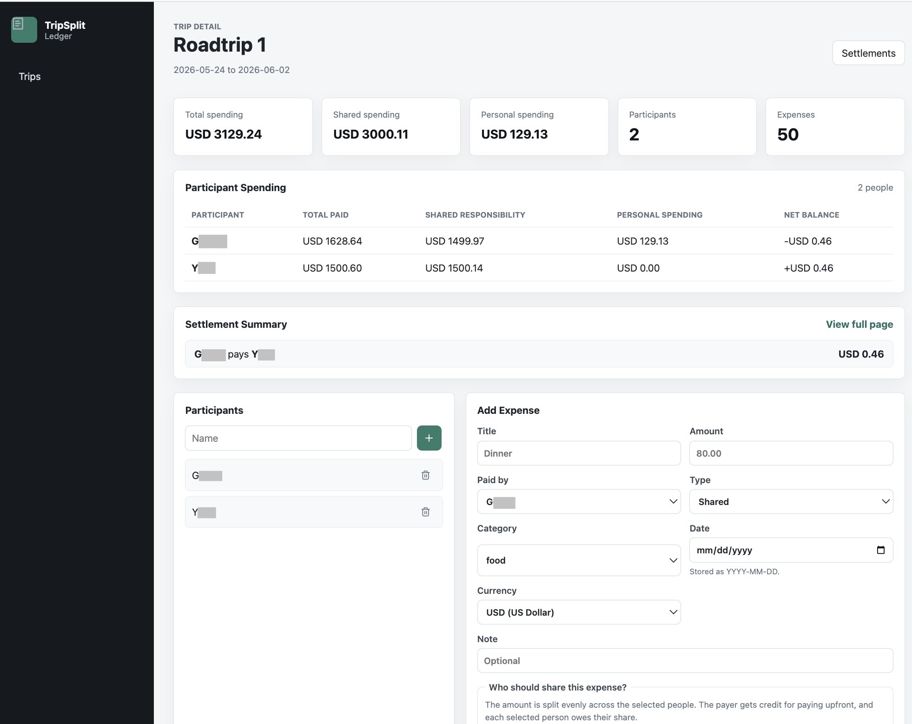

# TripSplit Ledger

After a group trip, I used Splitwise to settle expenses with friends and ran into a few frustrations: the free tier limits how many expenses you can log per day, and it doesn't show a full spending breakdown for the trip — only who owes whom. I wanted to see total spending by category, by day, and per person, not just the final settlement numbers.

That gap was the starting point. As I logged our actual trip expenses into an early version of this app, I kept noticing other things I wanted — filtering, expense types, CSV export, a per-person spending summary — and added them one by one. TripSplit Ledger is the result: a personal expense tracker built around how I actually think about group travel spending.

The first implementation uses a FastAPI backend with local JSON persistence.

## Screenshots




## Features

**Trip management**
- Create, edit, and delete trips with date ranges
- Per-trip dashboard showing total spending, shared spending, and personal spending at a glance

**Expenses**
- Add, edit, and delete expenses with title, amount, category, date, payer, currency, and an optional note
- Shared vs. personal expense types — personal expenses count toward your own spending but are excluded from settlement calculations
- Flexible split: choose which participants share each expense
- Expense shares calculated in integer cents to avoid floating-point rounding errors

**Filtering and search**
- Filter the expense ledger by category, payer, type (shared/personal), and date range
- Free-text search by title or note
- Sort by newest, oldest, or amount

**Spending summary**
- Per-participant breakdown: total paid, shared responsibility, personal spending, and net balance
- Category summary table showing shared vs. personal totals across all 7 categories
- Daily spending timeline

**Settlements**
- Simplified payment plan that minimizes the number of transactions
- Settlement amounts consistent with per-participant net balances

**Export**
- CSV export of the full expense ledger with all filters applied

## Known Limitations

- **Single-user, local only** — there is no authentication system yet. All trips are visible to anyone with access to the running instance. This works fine for personal use on a local machine, but is not suitable for shared or hosted deployment.
- **No multi-currency settlement** — expenses can be tagged with a currency, but settlement calculations are hidden when a trip mixes currencies. Exchange-rate conversion is not yet implemented.
- **JSON file storage** — data is persisted in a local JSON file. This is simple and requires no database setup, but is not safe for concurrent writes or multi-user scenarios.

## Planned

- User accounts with registration and login (JWT-based authentication)
- Replace JSON storage with a proper database (SQLite for local use, PostgreSQL for deployment)
- Exchange-rate conversion to enable settlements across mixed-currency trips
- Budget tracking per trip or per category

## Backend Setup

```bash
cd backend
python3 -m venv .venv
source .venv/bin/activate
pip install -r requirements.txt
uvicorn app.main:app --reload
```

The API will run at:

```text
http://localhost:8000
```

Health check:

```text
GET /api/health
```

Interactive API docs:

```text
http://localhost:8000/docs
```

## Frontend Setup

In a separate terminal:

```bash
cd frontend
npm install
npm run dev
```

The frontend will run at:

```text
http://localhost:5173
```

By default, the frontend calls the backend at `http://localhost:8000/api`.

## API Overview

Trips:

```text
GET    /api/trips
POST   /api/trips
GET    /api/trips/{trip_id}
PUT    /api/trips/{trip_id}
DELETE /api/trips/{trip_id}
```

Participants:

```text
GET    /api/trips/{trip_id}/participants
POST   /api/trips/{trip_id}/participants
DELETE /api/trips/{trip_id}/participants/{participant_id}
```

Expenses:

```text
GET    /api/trips/{trip_id}/expenses
POST   /api/trips/{trip_id}/expenses
GET    /api/trips/{trip_id}/expenses/{expense_id}
PUT    /api/trips/{trip_id}/expenses/{expense_id}
DELETE /api/trips/{trip_id}/expenses/{expense_id}
```

Dashboard and settlements:

```text
GET /api/trips/{trip_id}/dashboard
GET /api/trips/{trip_id}/settlements
```

## Calculation Logic

The backend calculates:

- Total trip spending
- Spending by category (shared and personal separately)
- Spending by day
- Amount paid by each person
- Amount owed by each person
- Net balances
- Simplified settlement payments

Expense shares are calculated in cents to avoid floating point drift.

## Example Expense Payload

```json
{
  "title": "Airport dinner",
  "amount": 84.5,
  "paid_by": "participant-id",
  "split_among": ["participant-id", "another-participant-id"],
  "category": "food",
  "date": "2026-07-01",
  "currency": "USD",
  "note": "First meal of the trip"
}
```

Supported categories:

```text
food, hotel, transportation, gas, tickets, shopping, other
```

## Tests

From the backend directory:

```bash
python3 -m unittest discover -s tests
```
